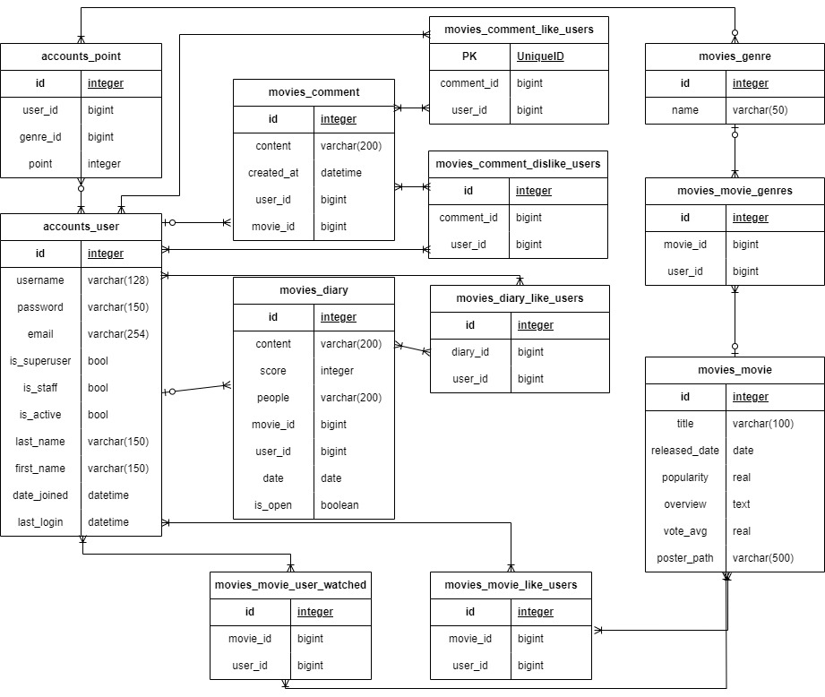
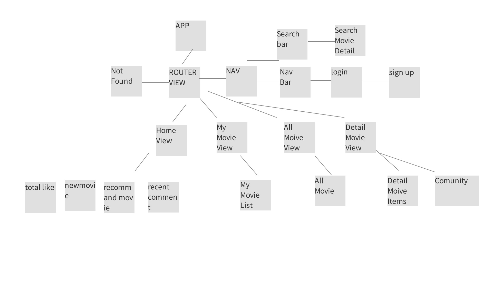
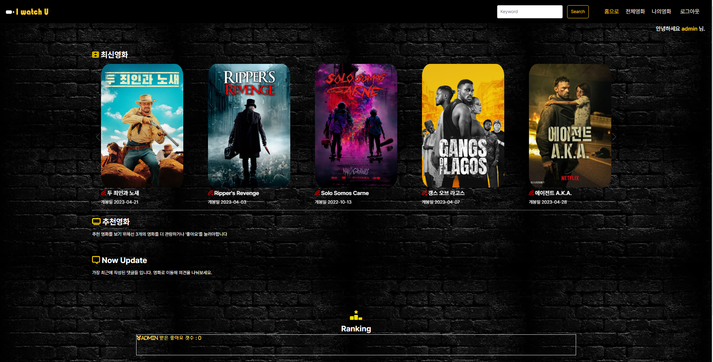
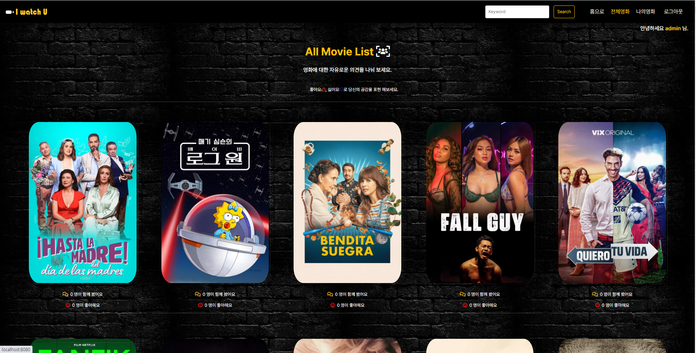
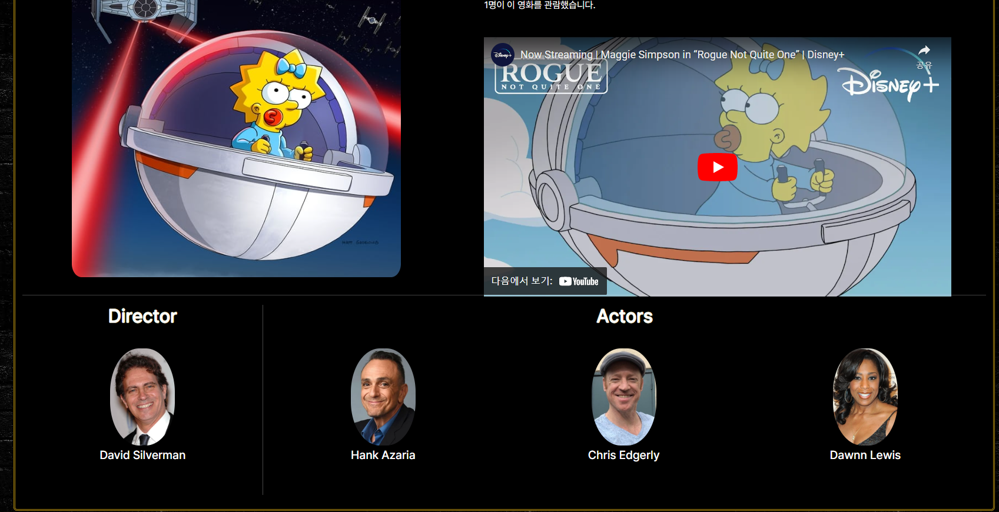
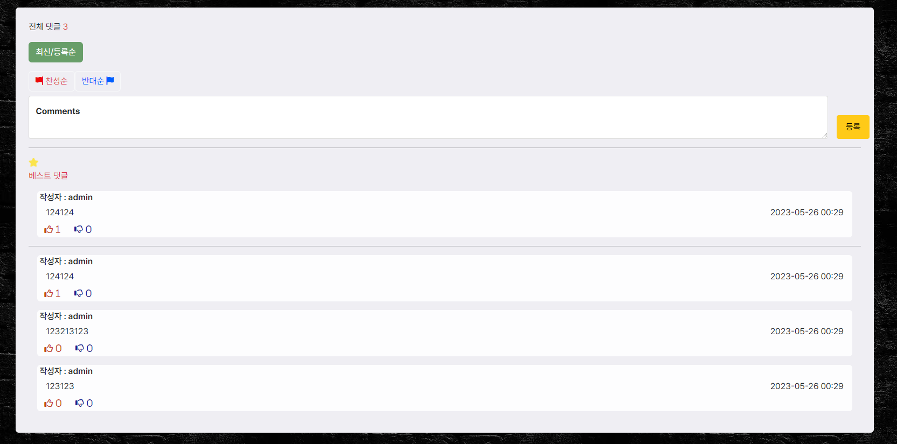
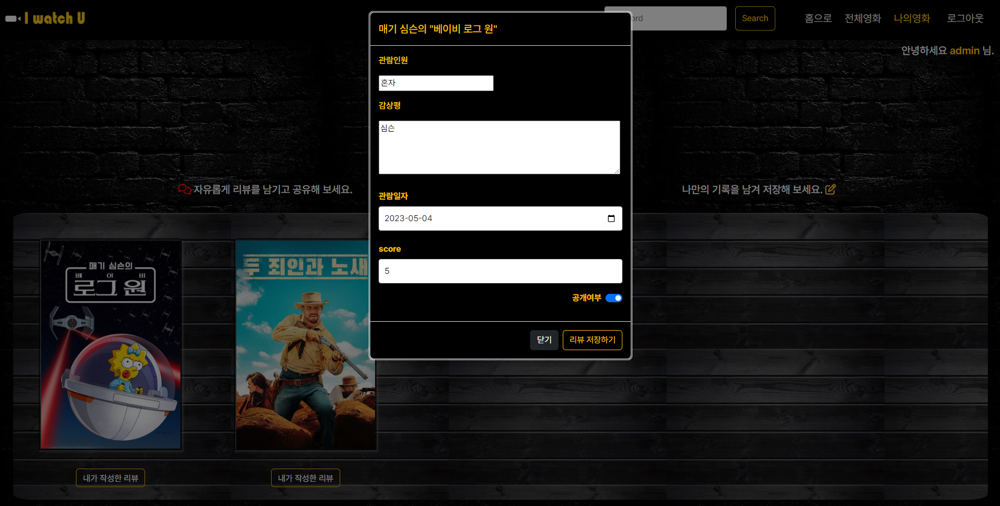
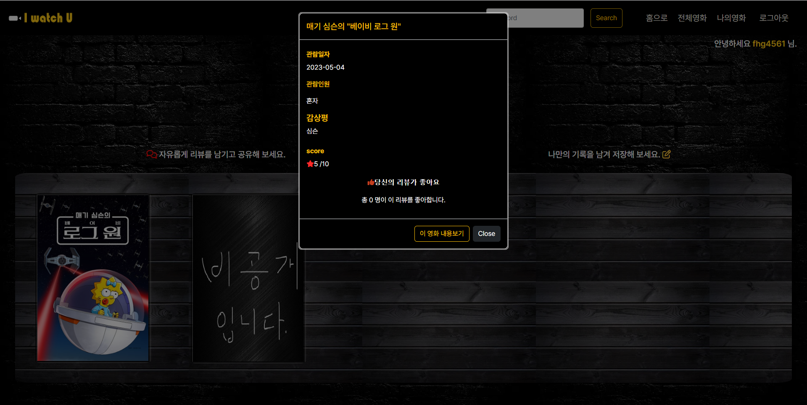

<h1 align="center">I-Watch-U</h1>

## 팀원

- 김동혁
  
  - 기획 및 django를 이용한 db 설계 및 backend 구축

- 신제형
  
  - 기획 및 vue 를 이용한 Front-end 구축 및 디자인 

## 사용 가능 기능

| 기능            | 기능설명                      |
|:------------- | ------------------------- |
| 로그인 /회원가입     | 토큰을 통한 유저 회원가입 및 인증 기능    |
| 로그아웃          | localstorge에 저장한 토큰 삭제 기능 |
| 최신 영화 조회      | 개봉일자를 기준으로 최신 영화 제공       |
| 전체 영화 조회      | db에 저장된 모든 영화 제공          |
| 추천 영화 조회      | 알고리즘에 기반한 추천 영화 제공 기능     |
| 영화 키워드 검색     | 키워드를 통한 db내 영화 검색 기능      |
| 단일 영화 페이지     | 단일 영화 상세 정보 제공 기능         |
| 영화 리뷰 작성      | 단일 영화 리뷰 작성 기능            |
| 영화 리뷰 좋아요/싫어요 | 리뷰에 대한 좋아요/싫어요 생성 기능      |
| 영화 관람 여부      | 해당 영화 관람 여부 확인 기능         |
| 영화 좋아요 여부     | 해당 영화 좋아요 생성 기능           |
| 나의 영화 리스트     | 관람한 영화 목록 제공 기능           |
| 영화 감상평 작성     | 관람한 영화에 대한 감상편 작성 기능      |
| 영화 감상평 감상     | 다른 유저가 작성한 감상편 관람 기능      |
| 영화 감상평 좋아요    | 다른 유저가 작성한 감상편 좋아요 생성기능   |

## ERD

## 목업

# 사이트 살펴보기

### 메인페이지

- 최신 영화 목록
  - 개봉일 기준으로 최신 영화 30개를 5개씩 보여주는 목록이 생성됩니다.
  - 영화 포스터에 마우스를 올리면,  해당 영화의 제목, 개요, 별점을 간단히 볼 수 있습니다.
- 추천영화 목록
  - 추천영화를 받기 위해서는 먼저 로그인을 해야합니다.
  - 로그인 이후에도 일정 조건을 만족해야만 추천 영화를 제공하도록 작동합니다.
  - 추천 영화도 후술할 알고리즘에 따라 최대 30개의 영화를 5개씩 보여주는 목록으로 제공합니다.
- 최신 댓글 목록
  - 가장 최근에 달린 댓글 5개를 보여줍니다.
  - 해당 댓글이 달린 영화 제목을 보여주며 제목을 클릭할 시 해댱 영화 페이지로 이동합니다.
  - 해당 목록에서는 좋아요/싫어요 기능을 사용할 수 없습니다.
- 가장 좋아요를 많이 받은 유저 순위
  - 나의 영화 페이지에서 좋아요를 가장 많이 받은 유저의 ID와 좋아요 개수를 보여줍니다.

### 전체 영화 목록

- 홈 화면의 확장판입니다.

- 기능은 홈 화면과 동일하게 해당 영화 포스터를 클릭시 영화 상세 페이지로 넘어갑니다.

### 영화상세페이지

- 영화 상세 페이지에서는 해당 영화의 예고편과 배우/감독 목록을 추가로 볼 수 있습니다

- 로그인이 되었을 시, 해당 영화에 대해 좋아요를 누르거나 관람한 영화로 추가할 수 있습니다.

### 영화 리뷰 작성

- 리뷰 작성란에서는 해당 영화에서 작성된 리뷰 목록을 볼 수 있습니다.
- 리뷰는 작성순/좋아요순/싫어요순으로 정리해서 볼 수 있으며 가장 좋아요가 많은 댓글은 베스트 댓글란에 추가로 표시됩니다.
- 만약 좋아요 수가 같을 시에는 싫어요 수가 적은 순으로, 싫어요 수까지 같다면 작성 시기가 빠른 댓글이 베스트 댓글이 됩니다.
- 해당 리뷰의 작성자 id를 클릭시 해당 유저의 영화 목록 페이지로 이동합니다.

### 나의 영화 목록

- 나의 영화 목록 - 사용자
  
  - 이곳에서는 유저가 관람한 영화 목록을 확인할 수 있습니다.
  - 추가적으로 관람한 영화에 대한 추가적인 정보를 작성할 수 있으며, 해당 정보의 공개 여부 또한 설정할 수 있습니다.추가적인 정보는관람인원 / 감상평 / 관람일자 / score 항목이 있으며, 잘못된 관람일자를 클릭하거나 범위 이외의 점수를 넣을 시 경고창을 띄웁니다.

- 나의 영화 목록 - 타사용자
  
  - 타 사용자들이 유저의 영화 목록 페이지를 확인할 수 있으며, 이 경우에는 해당 사용자가 공개설정한 영화 감상평만을 확인할 수 있습니다.
  - 사용자들은 해당 감상평에 좋아요를 누를 수 있으며,  나의 영화 메인 페이지에 받은 총아요의 총 갯수가 표시되며, 총 갯수를 토대로 홈 화면의 랭킹이 매겨지게 됩니다.

### 영화 추천 알고리즘

- 모든 유저는 최초 생성시 모든 영화 장르에 대해 최초 0점으로 시작하는 추천 점수를 가지고 생성된다.

- 만약 유저가 특정 영화를 관람하고 관람 버튼을 누를 시 해당 영화에 포함된 모든 장르에 1점을 추가한다.

- 만약 유저가 특정 영화에 좋아요를 누를 시 해당 영화의 장르 갯수에 따라 서로 다른 점수를 추가한다. (예시 - 특정 영화가 액션, 코미디, 애니메이션 장르를 포함하고 있을 시 순서대로 3점, 2점, 1점이 추가된다.)

- 만약 해당 영화의 관람 및 좋아요를 취소할 시 추가된 점수는 그대로 감산된다.

- 추천 영화 리스트를 생성하기 위해서 최소 3개 이상의 영화를 관람하거나 좋아요를 누르도록 vue에서 메세지로 표시한다. (메세지 내용 - 추천 영화를 보려면 n개의 영화를 관람하거나 좋아요를 눌러주세요)

- 해당 유저의 좋아요나 관람 영화가 3개 이상이 되었을 시 해당 유저의 점수가 가장 높은 장르 3개를 추출한 뒤 추출된 장르를 기준으로 1순위 추천 영화 2순위 추천 영화 그룹을 만든다.

- 1순위 추천 영화 - 최상위 3개의 장르를 모두 포함하고 있는 영화 / 2순위 추천 영화 - 최상위 3개 장르중 2개의 장르를 포함하고 있는 영화

- 1순위 목록의 영화가 30개 미만일 경우 추가적으로 2순위 추천영화를 추가하며 최대 30개의 추천영화 리스트를 생성한 뒤 유저에게 제공한다.

##### 느낀점

- 김동혁

2주간 프로젝트를 진행하면서 가장 어려움을 느낀 점은 데이터 설계였다. 1학기 동안 db를 배우면서 해왔던 과제들에서는 해당 db를 어떻게 연결해야할지 명확히 지시해주었기에 큰 어려움을 느끼지 못했지만 이번 최종 관통프로젝트에서는 특별한 지시없이 어떻게 db를 설계할지 스스로 생각했어야 하기에 프로젝트 중간마다 작고 큰 수정이 계속해서 이뤄졌다. 이런 상황에서 1학기 동안 배운 내용을 응용하기도 하고 또 모르는 부분을 배워나가기도 하면서 코드를 완성해나가니 1학기 동안 꽤나 많은 성장을 했다는 것을 스스로 느낄 수 있었던 프로젝트였다.

- 신제형

2주간 프로젝트를 진행하면서 어려움을 느꼈던것은 페이지의 구성을 어떻게 가져갈지 사용자의 입장에서 어떤 ui/ux 를 제공받는게 좋을것인가에 대한 생각이었다 . 또한 front-end 작업에 있어서 back-end 와 어떻게 연결을 시킬지에 대한 끊임없는 커뮤니케이션이 중요하다는것을 느꼈다. 

서로가 서로의 입장을 정확히 말해주고, 그에 따른 개발 진행을 할 때 매우 부드러운 진행을 할 수 있었다. 또한 프로젝트 중간 제한된 시간내에 해내야 하다보니 욕심이 생기는 부분에 대해서 포기를 하는 부분도 생겼는데, 실제 현업에서는 항상 시간에 쫓길텐데 그 안에서 실현가능한 목표를 정확하게 설정하고 그를 이뤄 낼 수 있도록 하는 능력을 발전시켜야 겠다고 생각했다. 

다행히 우리는 처음 기획단계에서 기획했던 모든것을 성공적으로 구현해냈다. 

그리고 하다보니 끊임없는 retry 가 실력상승의 지름길이라고 느꼈다. 

 bootstarp 과 css 를 이용한 디자인 그리고 vue.js 를 통한 동기, 비동기 처리 모두 학기중에는 어려움을 느꼈었는데 끊임없이 retry 하다보니 어느세 익숙하게 vue 를 다루고 있는 나를 발견했다. 

또한 front 업무를 하다보니 back 업무에 대해 더 잘 이해할 수 있게 된 계기이기도 했다. front 에서 필요한것을 어떻게 back 에서 다룰것인가에 대한 이해가 깊어졌다. 

무엇보다 좋은 동료와 함께 프로젝트를 진행 할 수 있어서 즐거웠다. 
